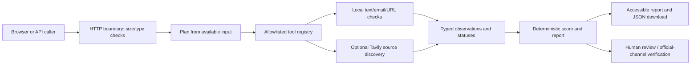

# Architecture

CareerShield is a small Python standard-library web application. `app.py` validates HTTP input and serves the browser UI; `careershield.agent` coordinates registered tools and constructs the report; `careershield.tools` owns deterministic inspections and the optional search adapter. No database or message queue is used.

## Agent lifecycle

1. **Intake:** the HTTP boundary accepts only known string fields with per-field and body limits.
2. **Plan:** the orchestrator lists the checks justified by fields actually supplied.
3. **Act:** the registry allowlists six local tools and one optional source-search tool. It limits calls to eight and the investigation to 15 seconds; each search request has a bounded timeout and response size.
4. **Observe:** every selected tool records a status, short result summary, duration, and provider. Failed or unavailable live search does not become a source.
5. **Decide:** each distinct check runs at most once. The orchestrator stops at the call/duration limit or after the finite plan is exhausted.
6. **Finalize:** deterministic rules produce findings, score, coverage, missing information, counter-evidence, safe next steps, and limitations. No LLM narrative can override findings.

The trace is an observable operational log of selected tools and outcomes. It does not reveal hidden chain-of-thought.

## Evidence and trust boundaries

- User-supplied text and URLs are untrusted data. Text cannot change the allowlisted tools or policies.
- Submitted URLs are parsed for structure only. The server never fetches them, preventing this app from becoming an SSRF proxy.
- Tavily receives a company name plus a fixed official-site/careers query. Provider-returned HTTPS results are included with title, URL, retrieval time, excerpt, relevance, and a status explicitly saying they are not independently verified.
- Each provider source is preserved from the actual response; no fallback or test fixture is presented as live evidence.
- Offer text is held in memory during a request and is not persisted by default. Request logs contain HTTP metadata, not form fields.

## Runtime bounds

The JSON/form request body is capped at 30,000 bytes. Field limits are in `app.py`. The tool registry clamps configured calls to 1–8, individual provider timeout to 0.1–10 seconds, and investigation duration to 1–30 seconds. Defaults are eight calls, four seconds per provider call, and 15 seconds total. The optional provider adapter caps response reads at 256,000 bytes and returned sources at four.

## Endpoints

See [API reference](API.md). The legacy `/analyze` form endpoint is preserved; the versioned `/api/v1/analyze` endpoint returns schema v2.
